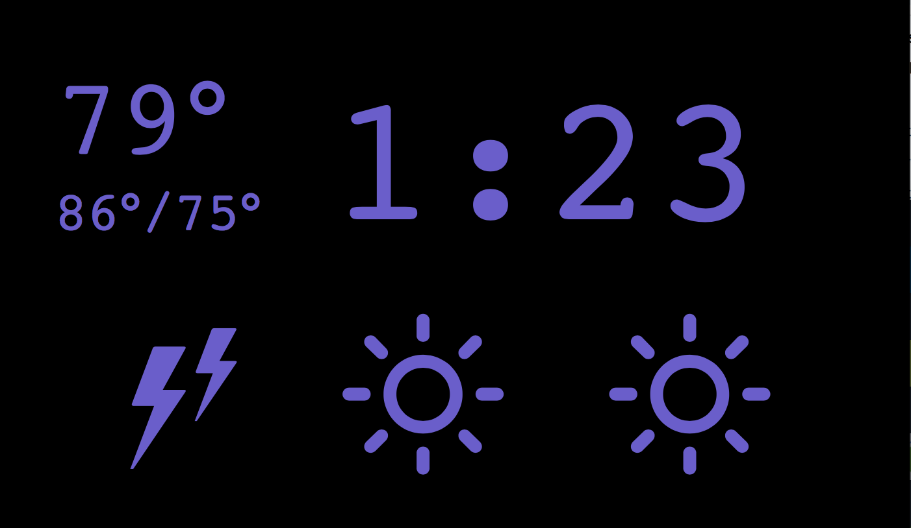

# ccclock

ccclock — cord cutters clock — is a clock for "cord cutters" who miss the always correct clock on their cable tv box. 

ccclock is built with [re-frame](https://github.com/Day8/re-frame) and intended to run locally on a raspberry pi with attached lcd; but can run in any browser anywhere.



## Development Mode

### Set Environment Variables & Secrets

Copy the example file, and update the values; this file is ignored by git for safety.

```
cp src/cljs/ccclock/environ.cljs.example src/cljs/ccclock/environ.cljs
```

### Start Cider from Emacs:

Put this in your Emacs config file:

```
(setq cider-cljs-lein-repl
	"(do (require 'figwheel-sidecar.repl-api)
         (figwheel-sidecar.repl-api/start-figwheel!)
         (figwheel-sidecar.repl-api/cljs-repl))")
```

Navigate to a clojurescript file and start a figwheel REPL with `cider-jack-in-clojurescript` or (`C-c M-J`)

### Compile css:

Compile css file once.

```
lein garden once
```

Automatically recompile css file on change.

```
lein garden auto
```

### Run application:

```
lein clean
lein figwheel dev
```

Figwheel will automatically push cljs changes to the browser.

Wait a bit, then browse to [http://localhost:3449](http://localhost:3449).

## Production Build


To compile clojurescript to javascript:

```
lein do clean, cljsbuild once, garden once
```
