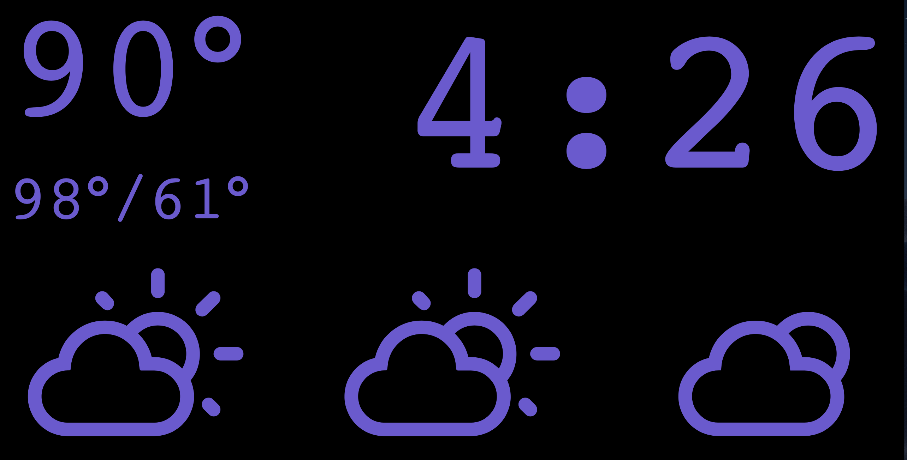

# ccclock

ccclock — cord cutters clock — is a clock for "cord cutters" who miss the always correct clock on their cable tv box. 

ccclock is built with [re-frame](https://github.com/Day8/re-frame) and intended to run locally on a raspberry pi with attached lcd; but can run in any browser anywhere.



## Development Mode

**Note:** When doing full stack development, start the ring server first and start figwheel last (via emacs or terminal).

### Set Environment Variables & Secrets

Copy the example file, and update the values; this file is ignored by git for safety.

```sh
cp profiles-example.clj profiles.clj
```

### Start Cider + Figwheel from Emacs

Put this in your Emacs config file:

```emacs-lisp
(setq cider-cljs-lein-repl
	"(do (require 'figwheel-sidecar.repl-api)
         (figwheel-sidecar.repl-api/start-figwheel!)
         (figwheel-sidecar.repl-api/cljs-repl))")
```

Navigate to a clojurescript file and start a figwheel REPL with `cider-jack-in-clojurescript` or (`C-c M-J`)

### Start Fighweel from Terminal:

```sh
lein do clean, garden once, figwheel dev
```

### Start Ring Backend from Terminal

```sh
lein ring server
```

### Automatically Recompile CSS File on Changes

```sh
lein garden auto
```

### See Changes Live in Your Browser

Figwheel will automatically push cljs changes to the browser.

Wait a bit, then browse to [http://localhost:3449](http://localhost:3449).

## Production Build

To compile clojurescript to javascript, compile css, and build jar file which serves the api-proxy and index.html:

```sh
lein with-profile prod uberjar
```

To run in production set the `WEATHER_APIKEY` environment variable and then run

```sh
java -jar target/ccclock.jar
```

## Notes

To deploy to a raspberry pi, I recommend the following:

- have rc.local launch your production jar
- set to boot to desktop and launch chromium in kiosk mode launching http://localhost:8000/index.html

Your browser may sit with a "cannot load page" or other such error for a couple minutes if it opens before the jvm launches your jar.
